***********
Color codes
***********

Prism leds are used to signal all differents mode of function and error codes. Here is all the possible color codes available.

For simpler search thorugth all codes select first the button's color:

.. csv-table::
   :widths: 1, 1, 1, 1, 1
   
   |btn green|, |btn red|, |btn yellow|, |btn purple|, |btn light blue|

.. The following are all link to the button images

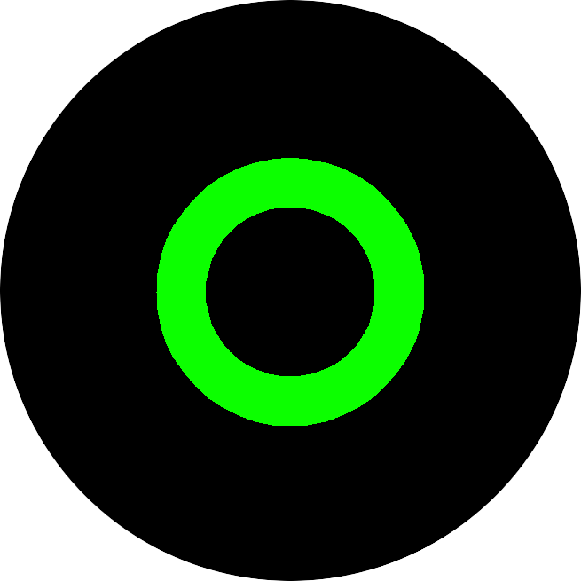

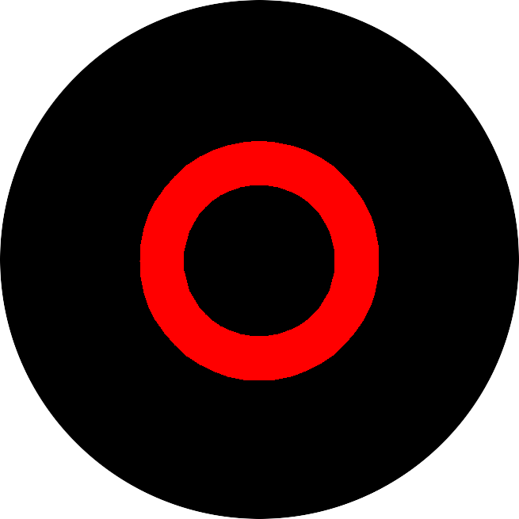

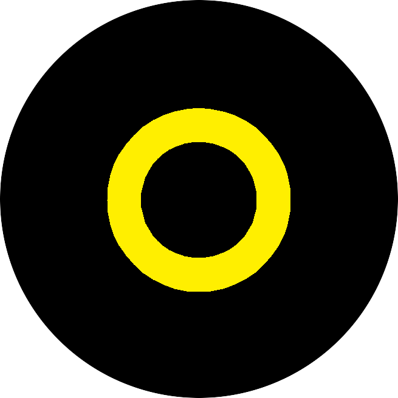

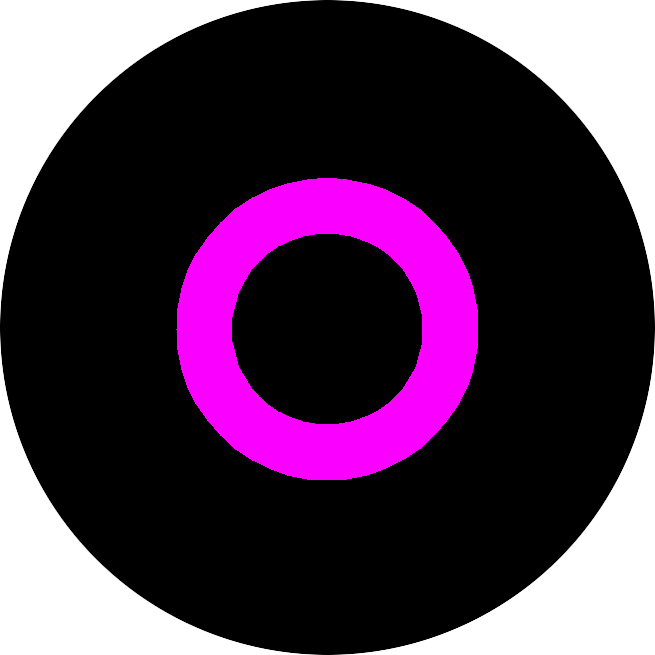

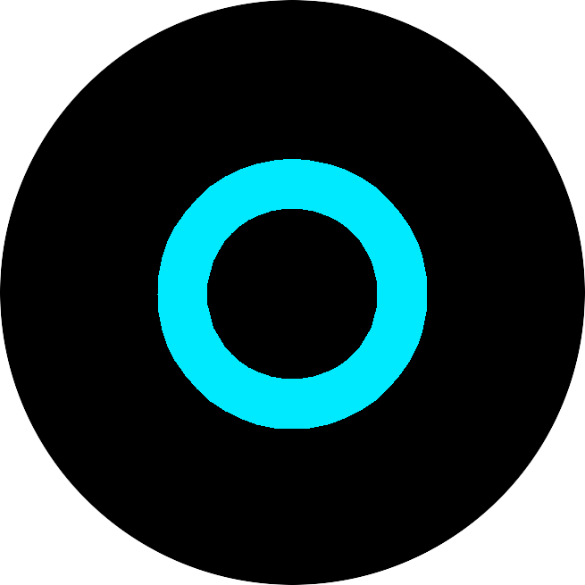

.. note:: "Can't find your color? Try `this section <Others_>`_ for other color codes"

Button green
============

.. csv-table::
   :widths: 1, 2, 3

   **Color**, **Name**, **Description**
   |green1|, "EV charging:", "EV charging from the main power" 
   |green2|, "Overheating", "Overheating, EV charge current is limited"
   |green3|, "Overcurrent", "Current above the set value (< +10%) but under maximum limit.
   
   EV charging continues."

.. link to images

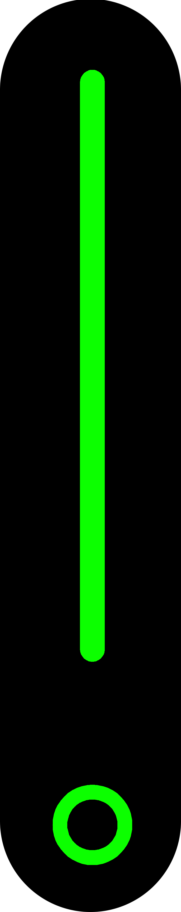

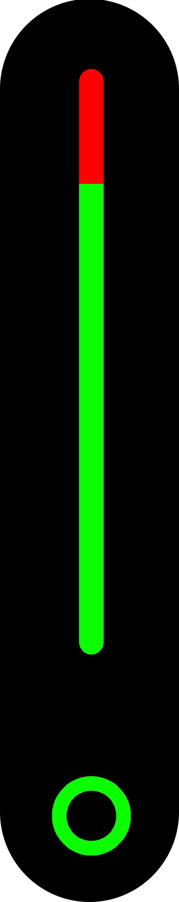

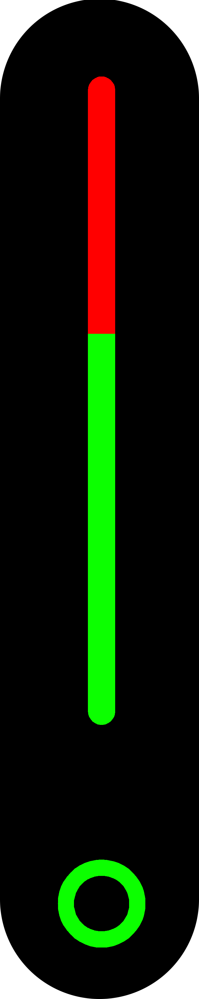

Button red
==========

.. csv-table::
   :widths: 1, 2, 3

   **Color**, **Name**, **Description**
   |red1|, "Overheat", "Temperature above limit, waiting for cooling" 
   |red2|, "EV error", "EV not recognized, charging not available"
   |red3|, "Overcurrent", "Current above the set value (> +10%) or above maximum limit.
   
   EV charging stops."
   |red4|, "Current leakage", "Current leakage, charging not allowed for safety reasons" 
   |red5|, "Relay stuck", "Relay unable to open; voltage is measured at the plug output.
   
   .. warning:: Disconnect everything and remove power. Don't touch the connector. Contact support."
   |red6|, "Voltage error", "Voltage drop too big, wires too thin or too long. Check installation." 
   |red7|, "RCD test error", "RCD test failed" 
   |red8|, "Overvoltage", "Voltage above maximum limit" 
   |red9|, "Internal error", "Internal software error" 

.. link to images

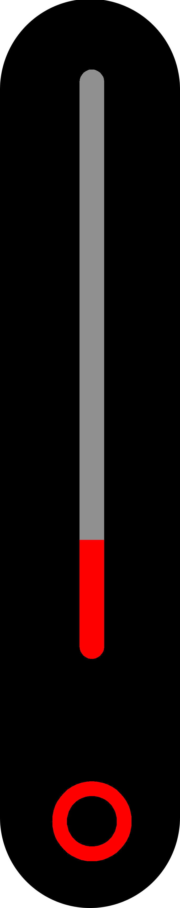

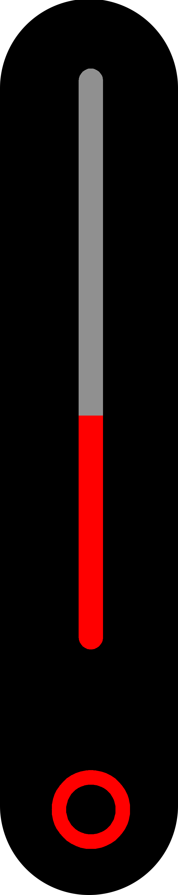

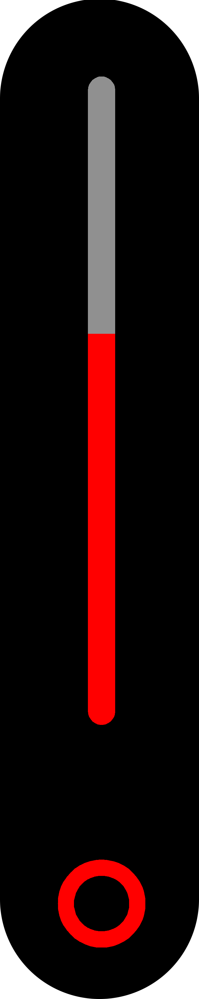

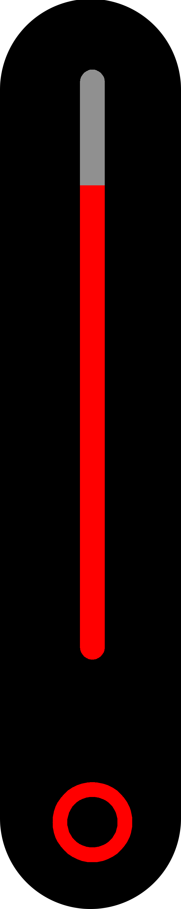

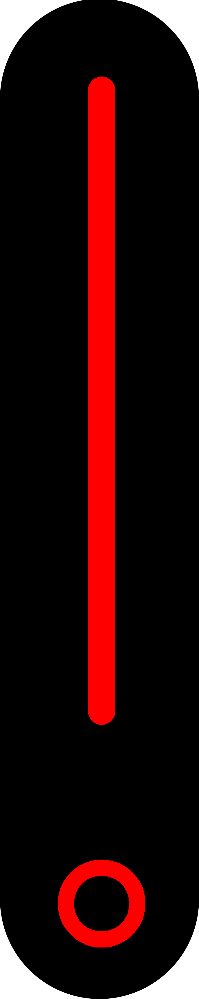

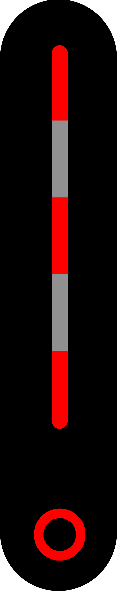

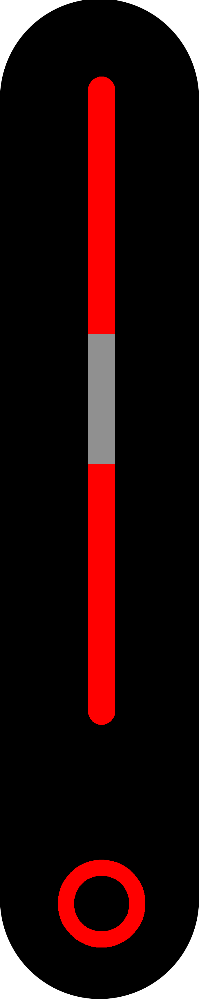

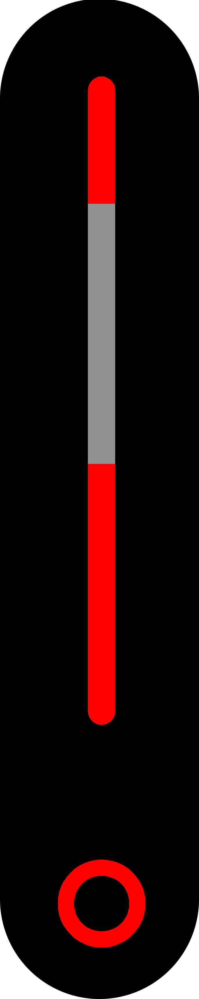

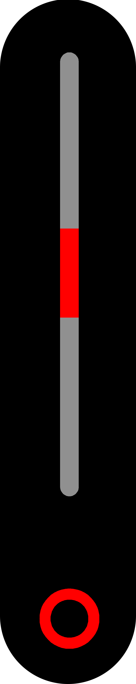

Button yellow
=============

.. csv-table::
   :widths: 1, 2, 3

   **Color**, **Name**, **Description**
   |yellow1|, "Solar charging", "Charging with some power coming from PV panels. 

   The yellow leds indicate the amount of power coming from solar, each led corresponds to 20% of the total power
   
   .. note:: In this figure the amount of power coming from solar is 60% (3 yellow leds)" 

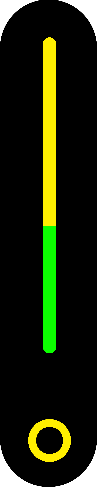

Button purple
=============

.. csv-table::
   :widths: 1, 2, 3

   **Color**, **Name**, **Description**
   |purple1|, "Update", "Update in progress.
   
   Device will reset when updating is completed" 

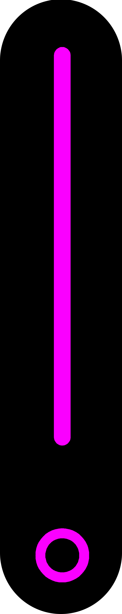

Button light blue
=================

.. csv-table::
   :widths: 1, 2, 3

   **Color**, **Name**, **Description**
   |ligh_blue1|, "Standby", "Prism in standby, ready for charging" 

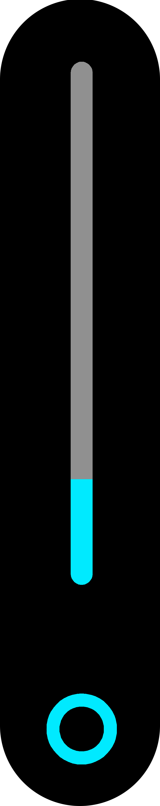

Others
======
.. csv-table::
   :widths: 1, 2, 3

   **Color**, **Name**, **Description**
   |other1|, "No internet", "No internet connection. User input available only from front panel or with AP connection.
   
   .. note:: only last led is purple, the other leds behave normally" 

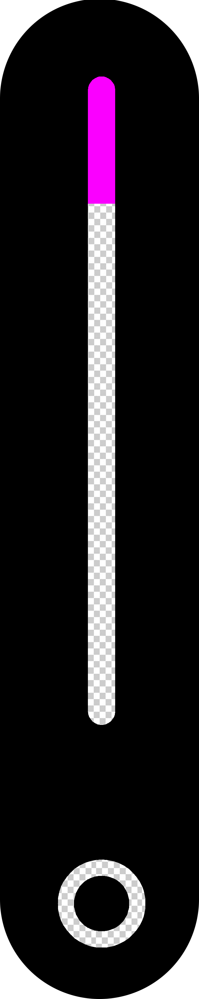
