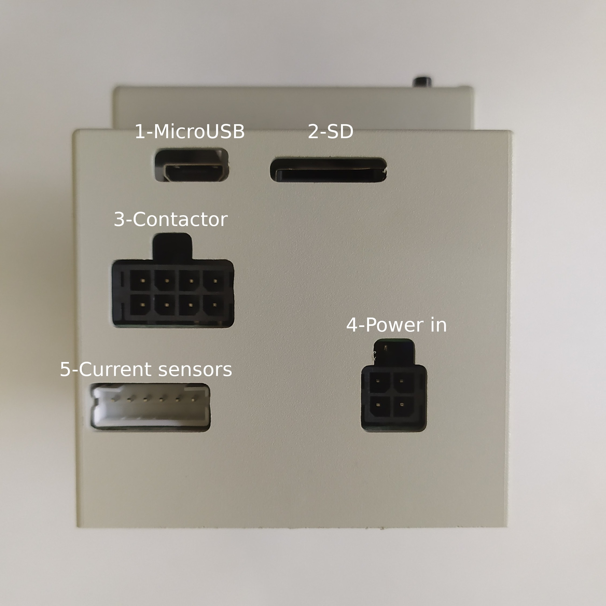
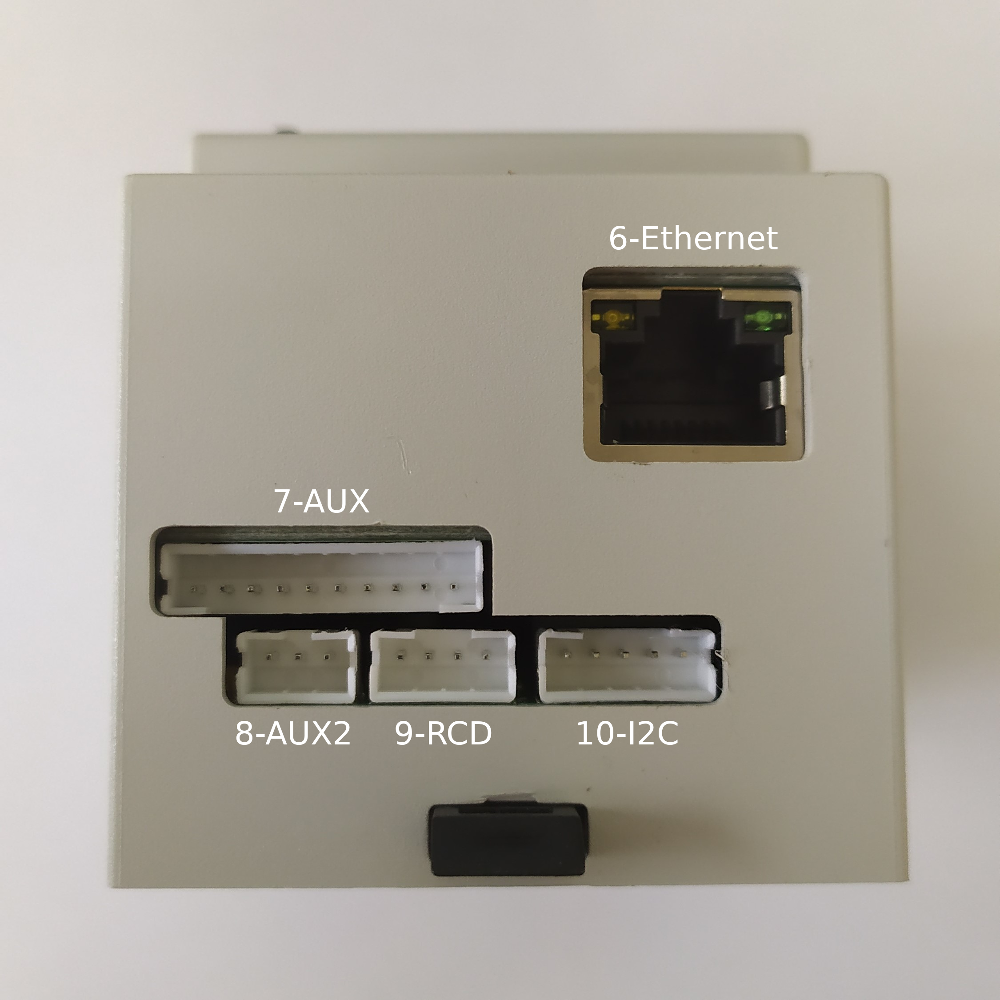
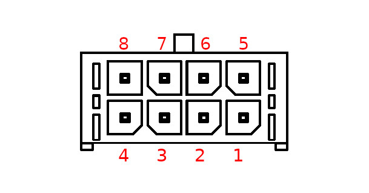
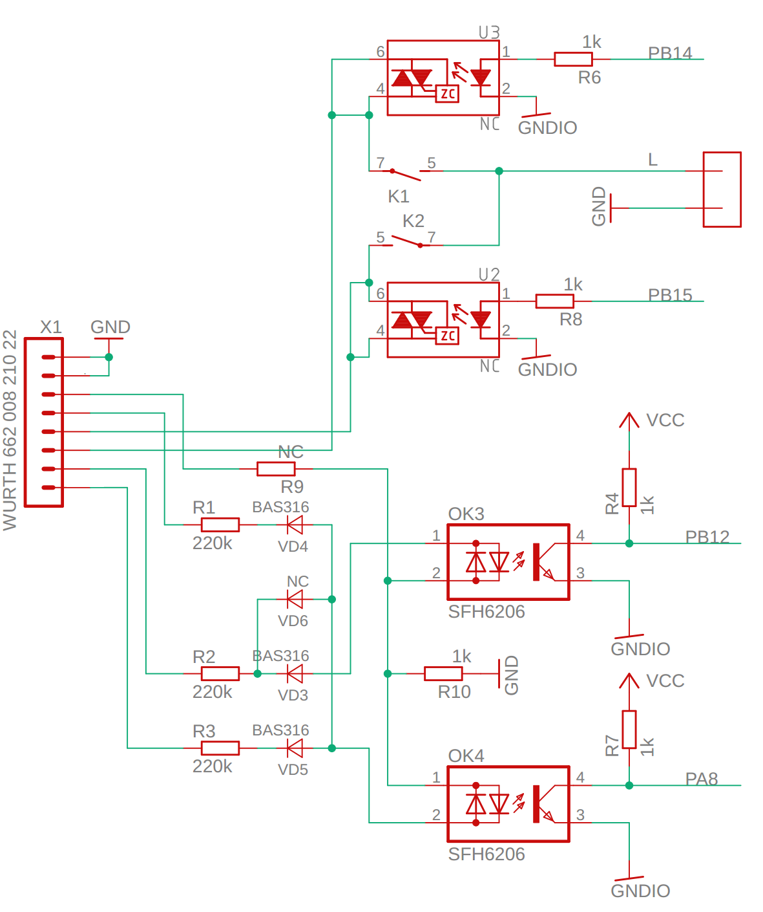
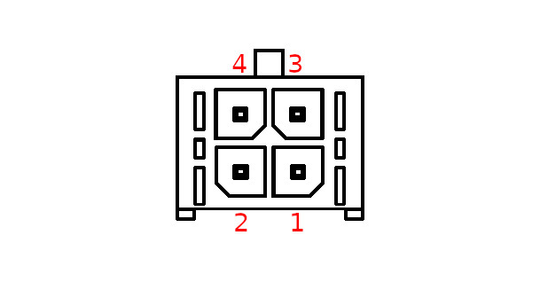
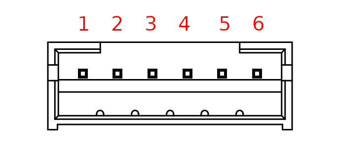
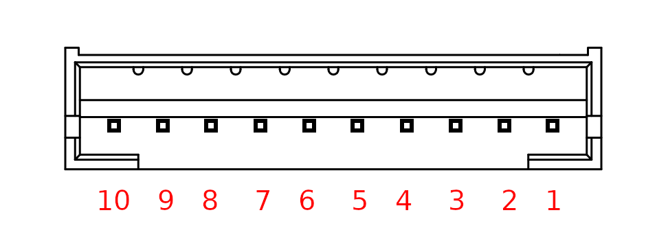
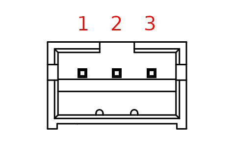
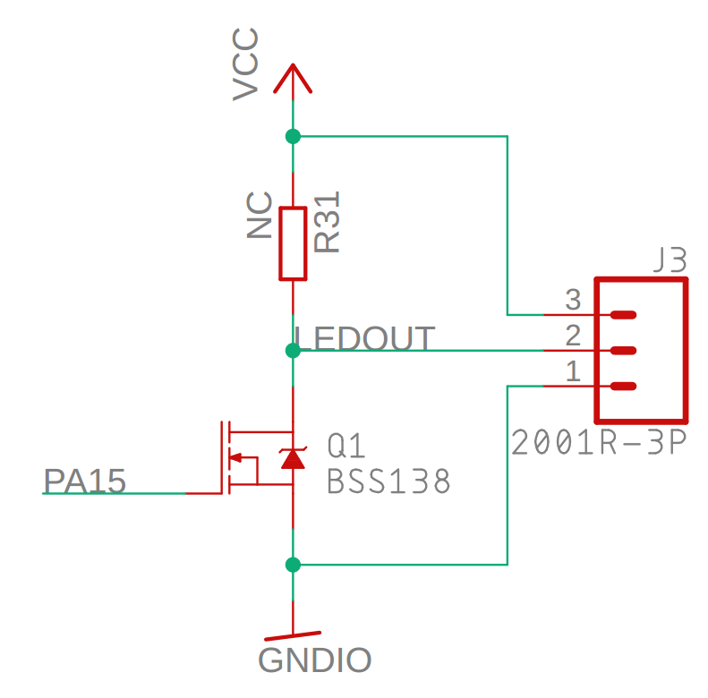
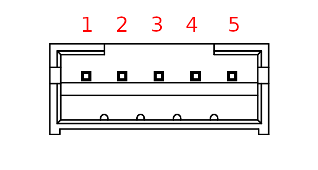

******
Pinout
******

Here you can find all the connectors pinout. 

.. note:: All the part numbers are for the mating connectors

Top view
========

.. csv-table::
   :widths: 10, 20, 20
   
   **Number**, **Description**, **Part Number**
   1, `Micro USB host <1. Micro USB host_>`_,
   2, `SD <2. SD_>`_,
   3, `Contactor <3. Contactor_>`_, Wurt Elektronik - 662008113322
   4, `Power input <4. Power input_>`_, Wurt Elektronik - 662004113322
   5, `Current sensors <5. Current sensors_>`_, JST - PHR-6

Bottom view
===========

.. csv-table::
   :widths: 10, 20, 20
   
   **Number**, **Description**, **Part Number**
   6, `Ethernet <6. Ethernet_>`_, 
   7, `AUX <7. AUX_>`_, JST - PHR-10
   8, `AUX2 <8. AUX2_>`_, JST - PHR-3
   9, `RCD <9. RCD_>`_, JST - PHR-4
   10, `I2C <10. I2C_>`_, JST - PHR-5

Front view
==========

.. figure:: _img/pinout/pinout_front.png
   :align: center   
   :width: 400px

.. csv-table::
   :widths: 10, 20, 20
   
   **Number**, **Description**, **Part Number**
   11, `Front Panel <11. Front Panel_>`_, JST - PHR-5

Connectors
==========

1. Micro USB host
-----------------

.. warning:: Max 250 mA

2. SD
-----
Micro SD slot to expand storage 

3. Contactor
------------

Drive contactors and check stuck condition.

.. csv-table::
   :widths: 10, 15, 60
   
   **Pin**, **Signal**, **Description**
   1, N, Neutral
   2, N, Neutral
   3, Ns, Neutral out sense (not used)
   4, LAs1, Line out sense A input 1
   5, CL2, Contactor 2 Live terminal
   6, CL1, Contactor 1 Live terminal
   7, LBs1, Line out sense B input 1
   8, LAs2, Line out sense A input 2

LAs1, LAs2 and LBs1 are connected to optocouplers to detect high voltages at the output of the contactor, to detect a welded contact.

Contactor coils can be driven by internal relays output. Connect the main one on pin 2 and 6, and the secondary one to pins 1 and 5.

Check the :doc:`Connection diagram <./conn_diagram>` for more details

4. Power input
--------------

Connects to neutral and all phases available (1 or 3).

.. csv-table::
   :widths: 10, 15, 60
   
   **Pin**, **Signal**, **Description**
   1, L3, Phase 3
   2, L2, Phase 2
   3, N, Neutral
   4, L1, Phase 1

5. Current sensors
------------------

Connects to the TA current sensor(s).

.. csv-table::
   :widths: 10, 15, 60
   
   **Pin**, **Signal**, **Description**
   1, A_P, Phase A TA input +
   2, A_N, Phase A TA input -
   3, B_P, Phase B TA input +
   4, B_N, Phase B TA input -
   5, C_P, Phase C TA input +
   6, C_N, Phase C TA input -

6. Ethernet
-----------

7. AUX
------

.. csv-table::
   :widths: 10, 15, 60
   
   **Pin**, **Signal**, **Description**
   1, PO2, "Pilot signal out 2"
   2, PO1, "Pilot signal out 1"
   3, RSB, "RS485 -"
   4, RSA, "RS485 +"
   5, CANH, "CAN high"
   6, CANL, "CAN low"
   7, LEDOUT, "Programmable digital output, internally pulled up"
   8, GND, Ground
   9, GND, Ground
   10, VCC, 5V

8. AUX2
-------

.. csv-table::
   :widths: 10, 15, 60
   
   **Pin**, **Signal**, **Description**
   1, VCC, 5V
   2, LEDOUT, "Programmable digital output, internally pulled up" 
   3, GND, Ground

Connector internal schematic:

9. RCD
------

Connects to an RCM14-03 residual current monitor.

.. figure:: _img/pinout/rcd_connector.png
    :align: center
    :height: 150px

.. csv-table::
   :widths: 10, 15, 60
   
   **Pin**, **Signal**, **Description**
   1, GND, Ground
   2, +12V, 12V
   3, TEST, RCD test output
   4, RCD_FAULT, RCD fault input

10. I2C
-------

I2C bus for communications. Internal 4K7 resistors.

.. csv-table::
   :widths: 10, 15, 60
   
   **Pin**, **Signal**, **Description**
   1, NC, "\-"
   2, SCL, I2C SCL
   3, SDA, I2C SDA
   4, 3V3, "3.3V"
   5, GND, Ground

11. Front Panel
---------------

Connects to front panel.

.. warning:: All logic must be at 3.3V

.. csv-table::
   :widths: 10, 15, 60
   
   **Pin**, **Signal**, **Description**
   1, RST, Reset
   2, RX, Serial receive
   3, TX, Serial transmit
   4, 5V, 5V
   5, GND, Ground
